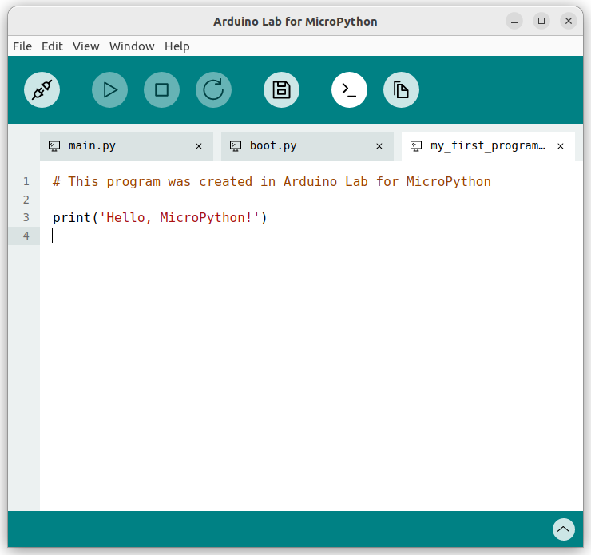
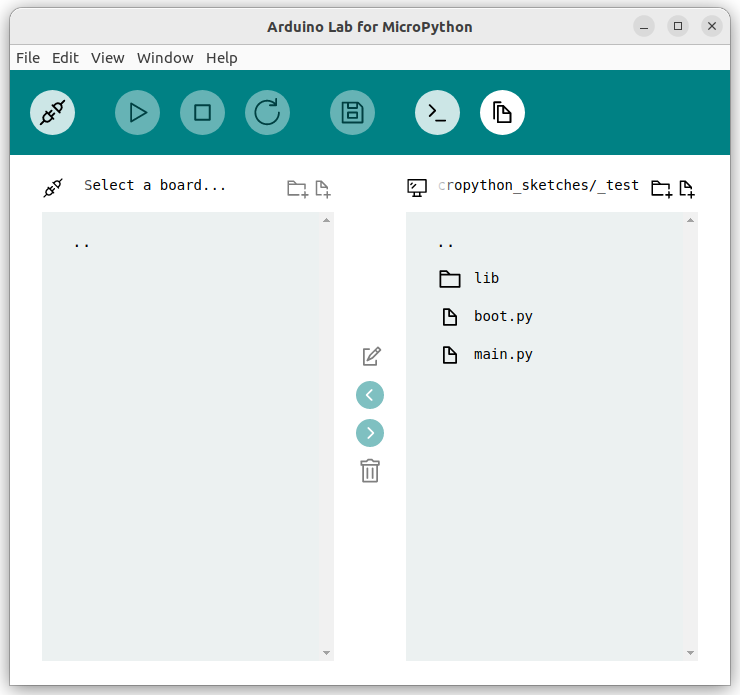

# Arduino Lab for MicroPython Editor

This UI is a [choo-choo](https://github.com/choojs/choo) app. It has pre-built dependencies so *no build process* is required for the interface.

The dependencies and source code are included manually in the `/ui/arduino/index.html` file. *No installation process* is required for the UI.

The is a standard [choo-choo](https://github.com/choojs/choo) app. It can be useful to learn more about [Choo](https://github.com/choojs/choo) or the [Elm Architecture](https://guide.elm-lang.org/architecture/).

In this folder you will find:

- `/ui/arduino/main.js`: A router deciding which view to load.
- `/ui/arduino/store.js`: A "store" that handles events emitted by the views, change the app state and orchestrate re-rendering.
- `/ui/arduino/libs`: Prebuilt dependencies.
- `/ui/arduino/views`: HTML views, components and elements.
  - Views: Page size layouts
  - Components: Independent sections that assemble the page layout
  - Elements: Thin abstraction on top of HTML tags.
- `/ui/arduino/media`: Icons and image assets.
- `/ui/arduino/documents`: System model and layout.
- `/ui/arduino/helpers.py`: MicroPython functions that enable some of the UI features.
